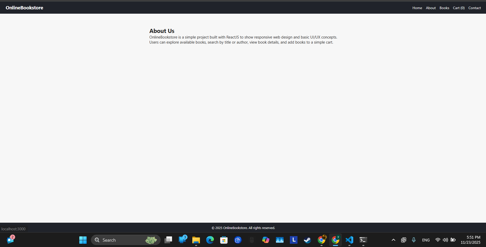
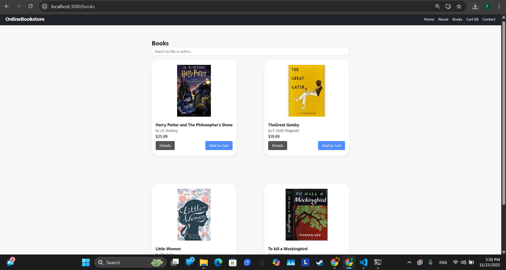
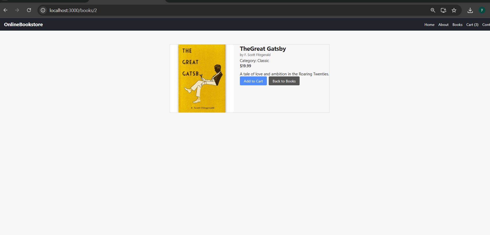
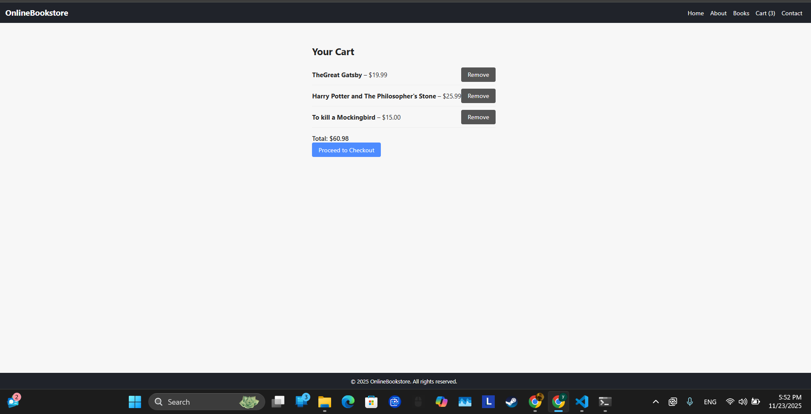
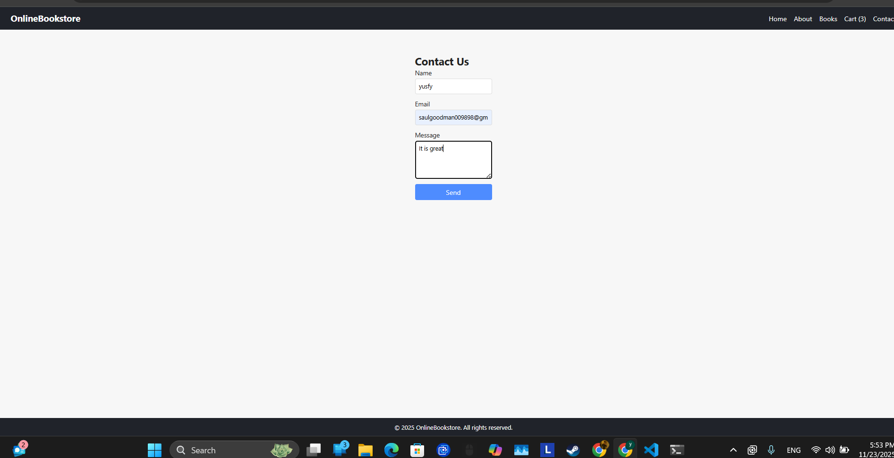

# Online Bookstore – React Web Application

This project is a simple online bookstore built using React.js. It allows users to browse books, search by title, view details, and add books to a shopping cart. The project demonstrates core React concepts including components, props, routing, state management, and reusable UI structure.

---

## Features

- Home page with hero section
- Books page with responsive grid layout
- Live search bar to filter books
- Book details page
- Add to cart, remove from cart, and clear cart
- About and Contact pages
- Responsive navbar and footer
- Simple and clean UI

---

## Technologies Used

- React.js
- React Router
- JavaScript
- Node.js & npm
- Git & GitHub

---

## Project Structure
online-bookstore
│
├── src/
│   ├── components/
│   │   ├── About.js
│   │   ├── BookCard.js
│   │   ├── BookDetails.js
│   │   ├── Books.js
│   │   ├── Cart.js
│   │   ├── Contact.js
│   │   ├── Footer.js
│   │   ├── Home.css
│   │   ├── Home.js
│   │   ├── Navbar.css
│   │   ├── Navbar.js
│   │   ├── SearchBar.js
│   │
│   ├── data/
│   │   └── books.js
│   │
│   ├── images/
│   │   ├── bookshop.jpg
│   │   ├── harrypotter.jpg
│   │   ├── home.jpg
│   │   ├── index.js
│   │   ├── littlewomen.jpg
│   │   ├── mockingbird.jpg
│   │   └── the-great-gatsby.jpg
│
│   ├── App.css
│   ├── App.js
│   ├── index.css
│   ├── index.js
│   └────
│
└────

##  Screenshots

###  Home Page

###  About Us

###  Books Page

###  Book Details

###  Cart

###  Contact Page

